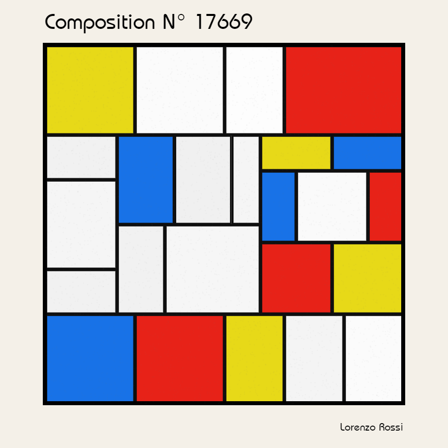
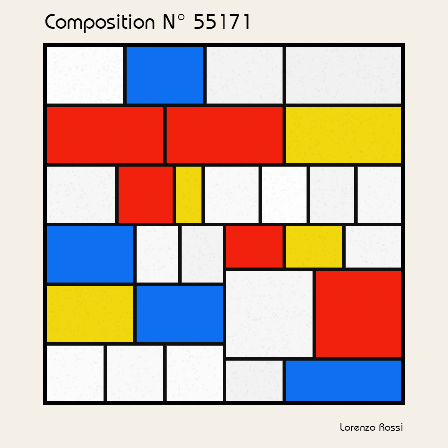
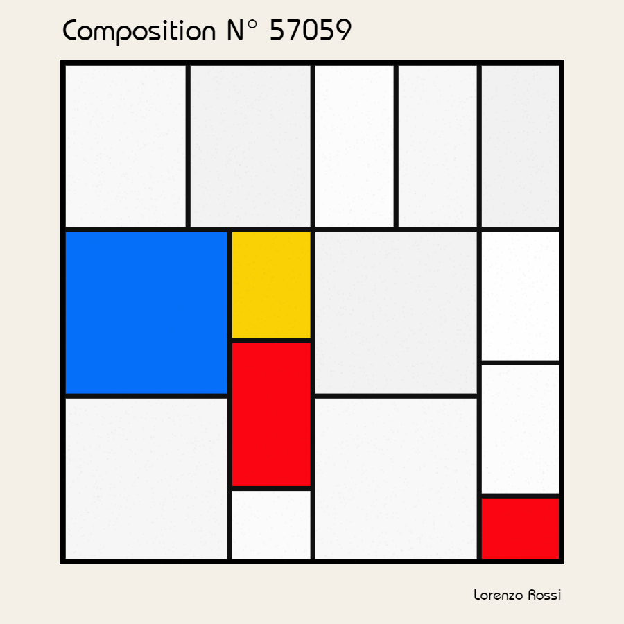
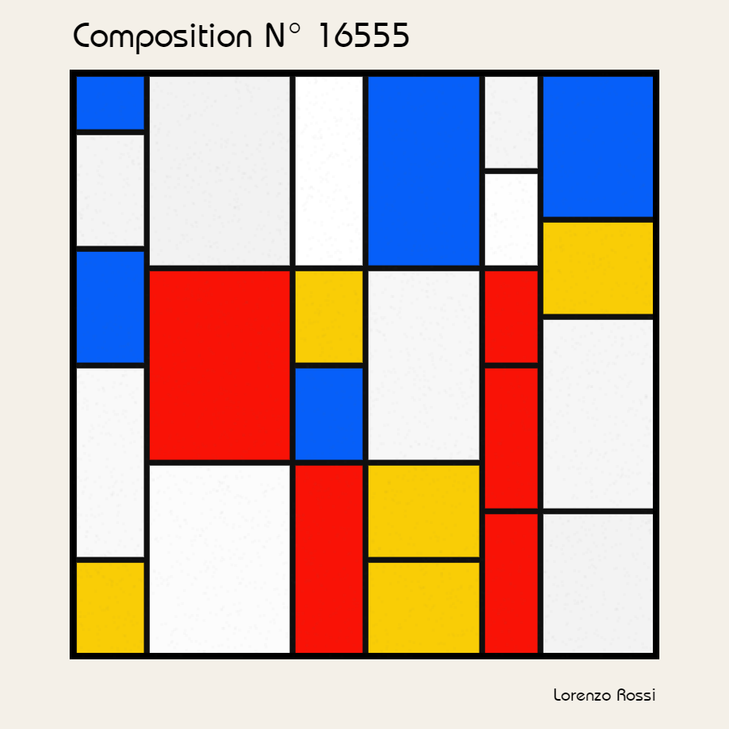
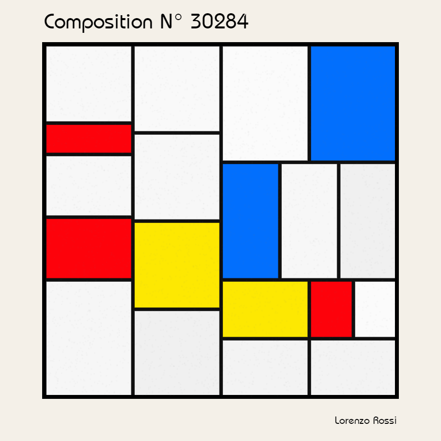

# Random Mondrian

## Try it here [lorenzoros.si/random-mondrian/](https://lorenzoros.si/random-mondrian/)

I like Mondrian, as I really like Bauhaus art, and it's very likely that I will be never able to afford one of his paintings. But what if i *reaaaally* wanted one of his artworks?

You could say that I could buy a cheap replica, or an even cheaper print. An that would make *a awesome lot of sense.* But, you know me. Or not. Just keep reading.

I could learn how to paint, and steal his style (isn't art, after all, just *stealing?*) but I can't. I do, however, like coding. So instead of going out and looking for an art shop (or just googling a painting and turning on my printer), I just decided that I would code yet another *something* to generate custom-made, hand-tailored, procedurally-generated faux mondrian-*esque* paintings. *Wow that's a lot of buzzwords.*

Try the project [here](https://lorenzoros.si/random-mondrian/) and download your **custom made, personal** Mondrian painting. *Guaranteed to be unique!*. If you're feeling lazy or just can't be bothered, check my [Instagram profile](https://www.instagram.com/lorossi97/) to see some pre-rendered images or just scroll below to see what this script is capable of.

## How does this work?

It's a really easy process, I gotta say.

First, a bunch of different colors are selected. The palette comes from one of Mondrian's painting.

Then the first rectangle is drawn, split in 2 or more parts (each one with the same size) and this process is repeated until all rectangles are small enough. Then, a certain (random) number of rectangles is picked and filled with one of the colors from the palette.

Lastly, the title is drawn and a few thousand small particles are added on top to give a little bit of texture to the image, just to ease the smoothness and precision of the pixel-perfect painting that the pc is able to do.

See, it's easy as that! *Way easier than learn how to paint, too.*

## Output

A few images generated by this script:

## Credits

This project is distributed under Attribution 4.0 International (CC BY 4.0) license.
